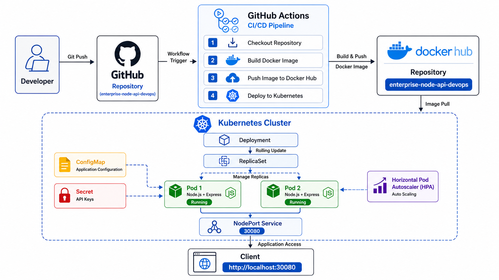
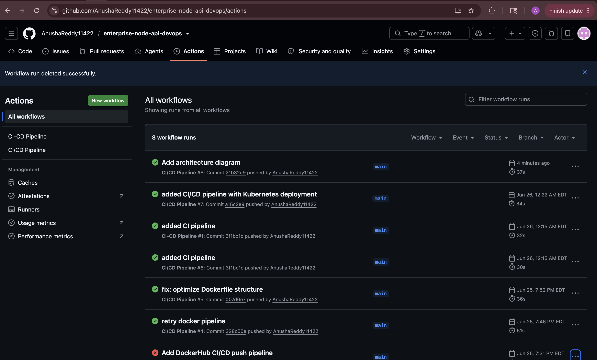
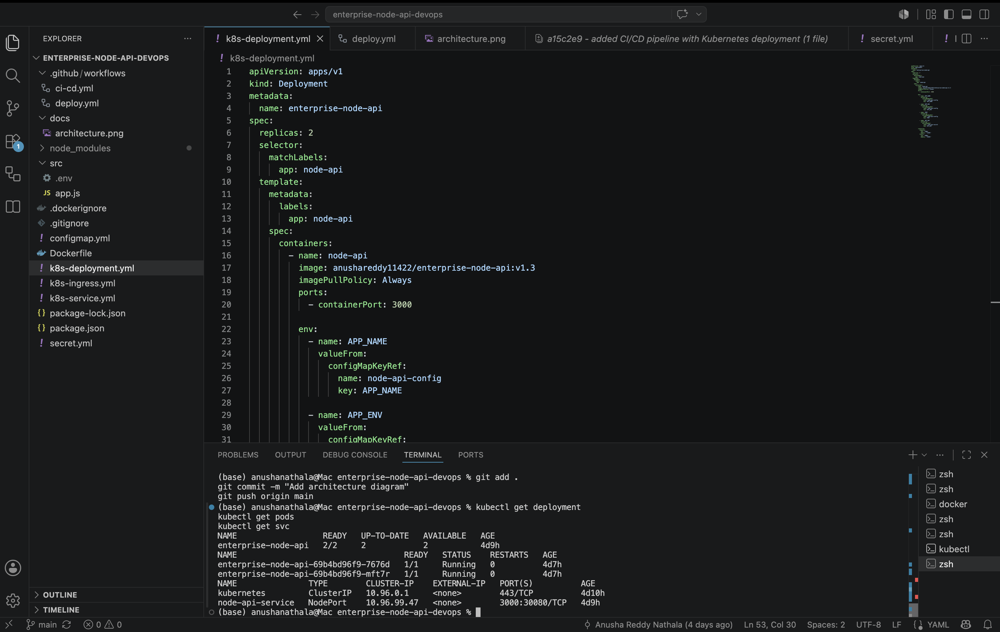
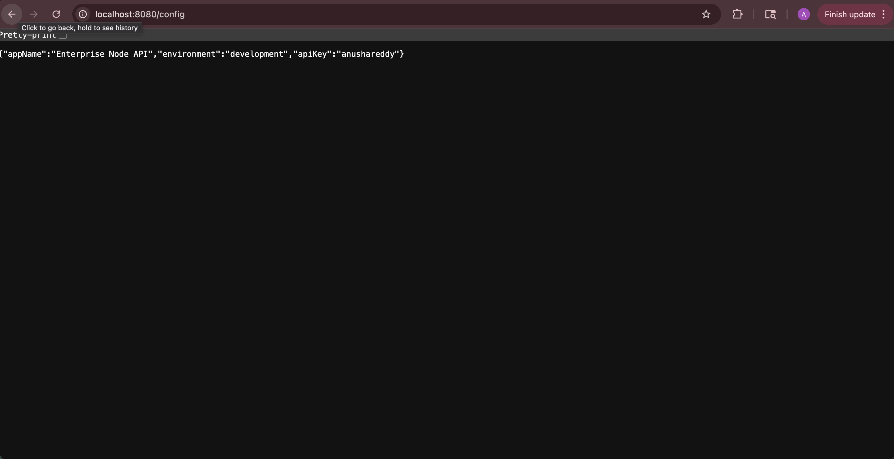

# 🚀 Enterprise Node API - Production-Style DevOps Project


## 📌 Overview

This project demonstrates an end-to-end DevOps workflow for deploying a containerized Node.js application on Kubernetes using GitHub Actions for Continuous Integration and Continuous Deployment (CI/CD).

The objective of this project is to simulate a real-world cloud-native deployment pipeline by implementing containerization, Kubernetes orchestration, automated deployments, configuration management, and application scaling.
## ⭐ Key Highlights

- 🚀 Automated CI/CD pipeline using GitHub Actions
- 🐳 Dockerized Node.js REST API
- ☸️ Kubernetes Deployment with Rolling Updates
- 📦 Docker Hub image versioning
- 🔐 Kubernetes ConfigMaps & Secrets
- 📈 Horizontal Pod Autoscaler (HPA)
- 🌐 NodePort & Ingress networking

---
## 🏗️ Architecture

The following diagram illustrates the complete CI/CD workflow and Kubernetes deployment architecture for this project.



```text
Developer
    │
Git Push
    │
    ▼
GitHub Repository
    │
    ▼
GitHub Actions
    │
    ├── Checkout Code
    ├── Build Docker Image
    ├── Push to Docker Hub
    └── Deploy to Kubernetes
                │
                ▼
          Docker Hub
                │
                ▼
      Kubernetes Cluster
                │
     ┌──────────┴──────────┐
     │                     │
 Deployment            ReplicaSet
     │                     │
 ┌───┴────┐
 │        │
Pod 1   Pod 2
 │        │
 └───┬────┘
     │
NodePort Service
     │
     ▼
 Application
```

---

# 🛠️ Technology Stack

| Category           | Technologies              |
| ------------------ | ------------------------- |
| Language           | Node.js                   |
| Framework          | Express.js                |
| Containerization   | Docker                    |
| Container Registry | Docker Hub                |
| Orchestration      | Kubernetes                |
| CI/CD              | GitHub Actions            |
| Configuration      | ConfigMaps                |
| Secret Management  | Kubernetes Secrets        |
| Scaling            | Horizontal Pod Autoscaler |
| Networking         | NodePort & Ingress        |
| Version Control    | Git & GitHub              |

---

# 📂 Repository Structure

```text
enterprise-node-api-devops/

├── .github/
│   └── workflows/
│       └── deploy.yml
│
├── src/
│   └── app.js
│
├── Dockerfile
├── package.json
│
├── k8s-deployment.yml
├── k8s-service.yml
├── k8s-ingress.yml
├── configmap.yml
├── secret.yml
│
├── README.md
```

---

## ✨ Features

- Containerized Node.js REST API using Docker
- Automated CI/CD pipeline with GitHub Actions
- Versioned Docker image publishing to Docker Hub
- Kubernetes Deployment with rolling updates
- Secure configuration using ConfigMaps and Secrets
- Horizontal Pod Autoscaler (HPA) for dynamic scaling
- Health monitoring endpoint for Kubernetes probes
- External application access using NodePort and Ingress
- Observability readiness (logs + metrics support)

---

# 🔄 CI/CD Workflow

1. Developer pushes code to GitHub.
2. GitHub Actions pipeline starts automatically.
3. Docker image is built.
4. Docker image is pushed to Docker Hub.
5. Kubernetes deployment is updated with the latest image.
6. Rolling update deploys the new version without downtime.

---

# 🚀 API Endpoints

| Endpoint  | Description                               |
| --------- | ----------------------------------------- |
| `/`       | Welcome endpoint                          |
| `/health` | Application health status                 |
| `/config` | Displays values from ConfigMap and Secret |

---

# ⚙️ Kubernetes Resources

The project includes the following Kubernetes resources:

* Deployment
* ReplicaSet
* Pods
* Service (NodePort)
* ConfigMap
* Secret
* Horizontal Pod Autoscaler (HPA)
* Ingress

---

# 📈 Future Enhancements

* GitOps using ArgoCD
* Helm Charts
* Prometheus Monitoring
* Grafana Dashboards
* AWS EKS Deployment
* Terraform Infrastructure as Code
* Blue-Green Deployment
* Canary Deployment

---

## 📸 Project Screenshots

### GitHub Actions Pipeline



---

### Kubernetes Pods



---

### Application Configuration Endpoint


---

# 👩‍💻 Author

**Anusha Reddy Nathala**

Cloud & DevOps Engineer

GitHub: https://github.com/AnushaReddy11422

LinkedIn: https://www.linkedin.com/in/anusha-reddy-nathala-281678214/
